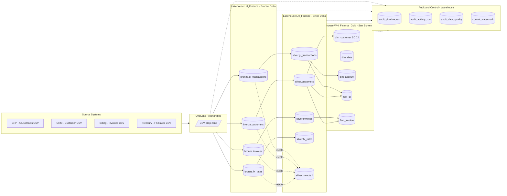
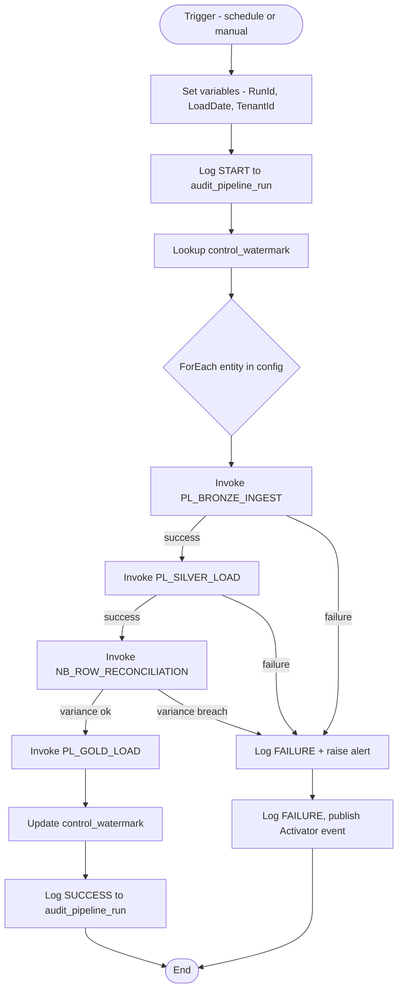

# Reference Architecture

## Medallion + Orchestration overview

## Orchestration control-flow

## Key architectural decisions

| Decision                          | Choice                                    | Rationale                                                                |
|-----------------------------------|-------------------------------------------|--------------------------------------------------------------------------|
| Storage                           | OneLake — Lakehouse Delta for B/S, Warehouse for G | Best-of-both: Spark for transform, T-SQL for BI serving.        |
| Orchestrator                      | Fabric Data Factory Pipelines             | Native, low-cost, integrates with Activator & Monitoring hub.            |
| Ingestion pattern                 | Metadata-driven Copy Activity + ForEach   | Add new source by INSERT to `config_source`; no pipeline code change.    |
| Silver transform                  | Dataflow Gen2 (Power Query) per entity    | Low-code, visual, analyst-maintainable. Reject rows routed to Warehouse. |
| Reconciliation                    | PySpark notebook                          | Hard-fails pipeline on variance breach — the one place a notebook wins.  |
| Retry policy                      | 3 retries, 30s interval on Copy & Notebook| Absorb transient OneLake / auth blips.                                   |
| Failure isolation                 | Try / Catch (`On Failure` + `On Skip`) per stage | One entity failure does not stop the batch — logged & alerted.    |
| Reconciliation                    | PySpark notebook comparing counts B↔S↔G   | Fails run when variance > configured tolerance (default 0.5%).           |
| Audit store                       | Warehouse tables (T-SQL, ACID)            | Simple to query from Power BI, supports transactional writes.            |
| Alerting                          | Fabric Activator on `audit_pipeline_run.status='Failed'` | No custom code, tenant-native.                                |
| Secrets                           | Workspace-scoped connections + Key Vault  | No credentials in pipeline JSON.                                         |
| Naming                            | `PL_`, `NB_`, `LH_`, `WH_`, `bronze.`, `silver.`, `gold.`, `audit_` | Discoverability + linting.                          |
