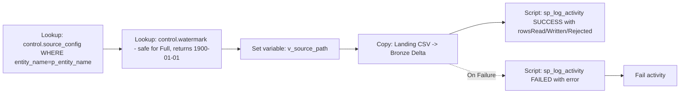

# PL_BRONZE_INGEST — Build Instructions

**Purpose:** copy landing CSV(s) for one entity into the Lakehouse Bronze Delta table with row-level audit and fault tolerance. Called once per entity by the master.

## Parameters
Standard six + inherits `p_entity_name`, `p_load_mode`.

## Activity graph



## Steps

### 1. Create pipeline `PL_BRONZE_INGEST`
Same six parameters. Add:
| Variable        | Type   | Purpose                          |
|-----------------|--------|----------------------------------|
| v_source_path   | String | Resolved landing path            |
| v_bronze_table  | String | Target Bronze Delta name         |
| v_watermark     | String | Incremental watermark value      |

### 2. `LKP_Config` (Lookup)
- Connection: `WH_Finance_Gold`
- Query:
  ```sql
  SELECT source_path, bronze_table, watermark_column
  FROM control.source_config
  WHERE entity_name = '@{pipeline().parameters.p_entity_name}';
  ```
- First row only: **true**.

### 3. `LKP_Watermark` (Lookup) — always runs; query is safe for Full loads
- Query:
  ```sql
  SELECT ISNULL((
      SELECT watermark_value
      FROM   control.watermark
      WHERE  entity_name = '@{pipeline().parameters.p_entity_name}'
        AND  '@{pipeline().parameters.p_load_mode}' = 'Incremental'
  ), '1900-01-01') AS wm;
  ```
- First row only: **true**.
- **No If Condition required.** For `Full` loads the query returns `'1900-01-01'` and the Copy activity ignores it (Full always reads all files). Simpler canvas, one less activity to maintain.

### 4. Set variable `v_source_path`
Value:
```
@{concat(
  activity('LKP_Config').output.firstRow.source_path,
  formatDateTime(pipeline().parameters.p_load_date,'yyyy'), '/',
  formatDateTime(pipeline().parameters.p_load_date,'MM'), '/',
  formatDateTime(pipeline().parameters.p_load_date,'dd'), '/'
)}
```

### 5. `CP_Land_To_Bronze` (Copy activity) — the key activity

**Source (Lakehouse Files, CSV):**
- Wildcard file path: `@variables('v_source_path')` + `*.csv`
- First row as header: true
- Recursive: true

**Sink (Lakehouse Table — Delta):**
- Table: `@variables('v_bronze_table')`
- Table action:
  - `Overwrite` when `p_load_mode = 'Full'`
  - `Append` when `p_load_mode = 'Incremental'`
- Enable partition discovery: false
- Extra columns (Additional columns tab):
  | Name          | Value                                            |
  |---------------|--------------------------------------------------|
  | _ingest_run_id| `@pipeline().parameters.p_run_id`                |
  | _ingest_ts_utc| `@utcNow()`                                      |
  | _source_file  | `$$FILEPATH`                                     |

**Settings tab (fault tolerance — critical):**
- **Data consistency verification:** on
- **Fault tolerance:** *Skip incompatible rows*
- **Log settings:** enable → Log path `Files/logs/copy/@{pipeline().parameters.p_run_id}/`
- **Enable staging:** off
- **Max concurrent connections:** 4
- **Retry:** 3, **Retry interval:** 30 s

Enabling *Skip incompatible rows + Log path* is what makes rows appear in the log so we can count and audit rejected rows.

### 6. `SCR_Log_Success` (Script activity) — On Success of Copy
```sql
EXEC audit.sp_log_activity
    @run_id           = '@{pipeline().parameters.p_run_id}',
    @activity_run_id  = '@{activity('CP_Land_To_Bronze').ActivityRunId}',
    @pipeline_name    = 'PL_BRONZE_INGEST',
    @activity_name    = 'CP_Land_To_Bronze',
    @activity_type    = 'Copy',
    @entity_name      = '@{pipeline().parameters.p_entity_name}',
    @layer            = 'Bronze',
    @start_time_utc   = '@{activity('CP_Land_To_Bronze').ExecutionStartTime}',
    @end_time_utc     = '@{activity('CP_Land_To_Bronze').ExecutionEndTime}',
    @status           = 'Succeeded',
    @rows_read        = @{activity('CP_Land_To_Bronze').output.rowsRead},
    @rows_written     = @{activity('CP_Land_To_Bronze').output.rowsCopied},
    @rows_rejected    = @{activity('CP_Land_To_Bronze').output.rowsSkipped},
    @rows_skipped     = @{activity('CP_Land_To_Bronze').output.rowsSkipped};
```

`rowsRead`, `rowsCopied`, `rowsSkipped` are Fabric Copy-activity **built-in output properties** — no notebook required.

### 7. `SCR_Log_Failure` (Script activity) — On Failure of Copy
```sql
EXEC audit.sp_log_activity
    @run_id           = '@{pipeline().parameters.p_run_id}',
    @activity_run_id  = '@{activity('CP_Land_To_Bronze').ActivityRunId}',
    @pipeline_name    = 'PL_BRONZE_INGEST',
    @activity_name    = 'CP_Land_To_Bronze',
    @activity_type    = 'Copy',
    @entity_name      = '@{pipeline().parameters.p_entity_name}',
    @layer            = 'Bronze',
    @start_time_utc   = '@{activity('CP_Land_To_Bronze').ExecutionStartTime}',
    @end_time_utc     = '@{utcNow()}',
    @status           = 'Failed',
    @error_code       = '@{activity('CP_Land_To_Bronze').Error.ErrorCode}',
    @error_message    = '@{activity('CP_Land_To_Bronze').Error.Message}';
```
Follow with a **Fail activity** so the caller (master) sees the failure and its own On-Failure handler triggers.

### 8. On success — update watermark (incremental only)
Add **If Condition** on `@equals(pipeline().parameters.p_load_mode,'Incremental')`. In the True branch add Script:
```sql
EXEC control.sp_update_watermark
    @entity_name      = '@{pipeline().parameters.p_entity_name}',
    @watermark_column = '@{activity('LKP_Config').output.firstRow.watermark_column}',
    @watermark_value  = '@{pipeline().parameters.p_load_date}';
```
