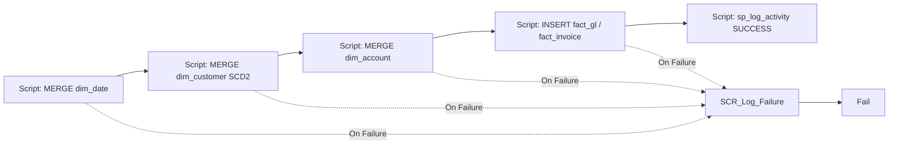

# PL_GOLD_LOAD — Build Instructions

**Purpose:** load the Gold Warehouse star schema. Reads Silver Delta via Lakehouse SQL endpoint, upserts dimensions (SCD2 for `dim_customer`), inserts facts, and logs everything.

Only invoked after `NB_ROW_RECONCILIATION` succeeds.

> **Fabric Warehouse T-SQL restrictions used below:**
> * `MERGE` is not supported → SCD2 uses `UPDATE ... FROM` + `INSERT ... WHERE NOT EXISTS`.
> * `IDENTITY` / `SEQUENCE` are not supported → surrogate keys are computed with `ROW_NUMBER() + ISNULL(MAX(sk),0)`.
> * `OPENROWSET(BULK ..., FORMAT='delta')` is **not supported** (that's Synapse Serverless syntax). Read Silver via **cross-database three-part naming** against the Lakehouse's SQL analytics endpoint: `FROM [LH_Finance].[silver].[gl_transactions]`.
> * **Prereq:** enable **Schemas (preview)** on `LH_Finance` so `silver.*` exists as a schema. Without it, tables land under `dbo`.

## Activity graph



## Steps

### 1. Create pipeline `PL_GOLD_LOAD`
Same six parameters.

### 2. `SCR_Upsert_Dim_Customer` (Script) — SCD2 without MERGE
```sql
-- Only run when entity is customers OR when running full-load
IF '@{pipeline().parameters.p_entity_name}' NOT IN ('customers','ALL') RETURN;

-- Stage the source
DROP TABLE IF EXISTS #src_customer;
CREATE TABLE #src_customer (
    customer_id   VARCHAR(50),
    customer_name VARCHAR(200),
    country_code  VARCHAR(10),
    segment       VARCHAR(50),
    is_active     BIT,
    row_hash      BINARY(20)
);

INSERT INTO #src_customer
SELECT customer_id, customer_name, country_code, segment, CAST(is_active AS BIT),
       HASHBYTES('SHA1', CONCAT_WS('|',customer_name,country_code,segment,CAST(is_active AS VARCHAR(1))))
FROM   [LH_Finance].[silver].[customers];

-- 1) Expire current rows whose attributes changed
UPDATE tgt
SET    is_current = 0,
       valid_to_utc = SYSUTCDATETIME()
FROM   gold.dim_customer tgt
JOIN   #src_customer src ON src.customer_id = tgt.customer_id AND tgt.is_current = 1
WHERE  HASHBYTES('SHA1', CONCAT_WS('|',tgt.customer_name,tgt.country_code,tgt.segment,CAST(tgt.is_active AS VARCHAR(1)))) <> src.row_hash;

-- 2) Insert net-new + new versions
DECLARE @maxSk BIGINT = ISNULL((SELECT MAX(customer_sk) FROM gold.dim_customer), 0);

INSERT INTO gold.dim_customer(customer_sk, customer_id, customer_name, country_code, segment, is_active, valid_from_utc, valid_to_utc, is_current)
SELECT @maxSk + ROW_NUMBER() OVER (ORDER BY src.customer_id),
       src.customer_id, src.customer_name, src.country_code, src.segment, src.is_active,
       SYSUTCDATETIME(), NULL, 1
FROM   #src_customer src
WHERE  NOT EXISTS (
         SELECT 1 FROM gold.dim_customer c
         WHERE  c.customer_id = src.customer_id AND c.is_current = 1);
```

### 3. `SCR_Insert_Fact_GL` (Script)
```sql
IF '@{pipeline().parameters.p_entity_name}' NOT IN ('gl_transactions','ALL') RETURN;

INSERT INTO gold.fact_gl (txn_id, date_key, customer_sk, account_sk, cost_centre, currency_code,
                          amount_ccy, amount_gbp, fx_rate, source_system, load_run_id, load_date)
SELECT  g.txn_id,
        CONVERT(INT, CONVERT(VARCHAR(8), g.posting_date, 112)) AS date_key,
        c.customer_sk,
        a.account_sk,
        g.cost_centre,
        g.currency_code,
        g.amount,
        g.amount * fx.rate,
        fx.rate,
        g.source_system,
        '@{pipeline().parameters.p_run_id}',
        '@{pipeline().parameters.p_load_date}'
FROM    [LH_Finance].[silver].[gl_transactions] g
LEFT JOIN gold.dim_customer c ON c.customer_id = g.customer_id AND c.is_current = 1
JOIN    gold.dim_account a  ON a.account_code = g.account_code
JOIN    [LH_Finance].[silver].[fx_rates] fx
        ON fx.from_ccy = g.currency_code AND fx.rate_date = g.posting_date;
```

### 4. `SCR_Log_Success` (Script)
```sql
EXEC audit.sp_log_activity
    @run_id           = '@{pipeline().parameters.p_run_id}',
    @activity_run_id  = NEWID(),
    @pipeline_name    = 'PL_GOLD_LOAD',
    @activity_name    = 'Gold_Merge_Insert',
    @activity_type    = 'Script',
    @entity_name      = '@{pipeline().parameters.p_entity_name}',
    @layer            = 'Gold',
    @start_time_utc   = '@{pipeline().TriggerTime}',
    @end_time_utc     = '@{utcNow()}',
    @status           = 'Succeeded';
```

### 5. On-failure branch
Same shape as previous pipelines — Script that logs `Failed`, then Fail activity.
