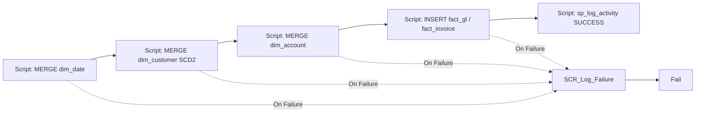

# PL_GOLD_LOAD — Build Instructions

**Purpose:** load the Gold Warehouse star schema. Reads Silver Delta via Lakehouse SQL endpoint, upserts dimensions (SCD2 for `dim_customer`), inserts facts, and logs everything.

Only invoked after `NB_ROW_RECONCILIATION` succeeds.

## Activity graph



## Steps

### 1. Create pipeline `PL_GOLD_LOAD`
Same six parameters.

### 2. `SCR_Upsert_Dim_Customer` (Script) — SCD2 example
```sql
-- Only run when entity is customers OR when running full-load
IF '@{pipeline().parameters.p_entity_name}' NOT IN ('customers','ALL') RETURN;

WITH src AS (
    SELECT customer_id, customer_name, country_code, segment, CAST(is_active AS BIT) AS is_active,
           HASHBYTES('SHA1', CONCAT_WS('|',customer_name,country_code,segment,is_active)) AS row_hash
    FROM   OPENROWSET(BULK 'silver.customers', FORMAT='delta') AS s   -- via Lakehouse SQL endpoint shortcut
)
MERGE gold.dim_customer AS tgt
USING src
   ON tgt.customer_id = src.customer_id AND tgt.is_current = 1
WHEN MATCHED AND HASHBYTES('SHA1', CONCAT_WS('|',tgt.customer_name,tgt.country_code,tgt.segment,tgt.is_active)) <> src.row_hash
  THEN UPDATE SET is_current = 0, valid_to_utc = SYSUTCDATETIME()
WHEN NOT MATCHED BY TARGET
  THEN INSERT (customer_sk, customer_id, customer_name, country_code, segment, is_active, valid_from_utc, valid_to_utc, is_current)
       VALUES (NEXT VALUE FOR gold.seq_customer_sk, src.customer_id, src.customer_name, src.country_code, src.segment, src.is_active, SYSUTCDATETIME(), NULL, 1);

-- Insert a new current row for changed customers
INSERT INTO gold.dim_customer(customer_sk, customer_id, customer_name, country_code, segment, is_active, valid_from_utc, valid_to_utc, is_current)
SELECT NEXT VALUE FOR gold.seq_customer_sk, s.customer_id, s.customer_name, s.country_code, s.segment, CAST(s.is_active AS BIT), SYSUTCDATETIME(), NULL, 1
FROM   src s
JOIN   gold.dim_customer c ON c.customer_id = s.customer_id AND c.is_current = 0 AND c.valid_to_utc >= DATEADD(minute,-1,SYSUTCDATETIME())
WHERE  NOT EXISTS (SELECT 1 FROM gold.dim_customer x WHERE x.customer_id = s.customer_id AND x.is_current = 1);
```

### 3. `SCR_Insert_Fact_GL` (Script)
```sql
IF '@{pipeline().parameters.p_entity_name}' NOT IN ('gl_transactions','ALL') RETURN;

INSERT INTO gold.fact_gl (txn_id, date_key, customer_sk, account_sk, cost_centre, currency_code,
                          amount_ccy, amount_gbp, fx_rate, source_system, load_run_id, load_date)
SELECT  g.txn_id,
        CONVERT(INT, CONVERT(VARCHAR(8), g.posting_date, 112)) AS date_key,
        c.customer_sk,
        a.account_sk,
        g.cost_centre,
        g.currency_code,
        g.amount,
        g.amount * fx.rate,
        fx.rate,
        g.source_system,
        '@{pipeline().parameters.p_run_id}',
        '@{pipeline().parameters.p_load_date}'
FROM    OPENROWSET(BULK 'silver.gl_transactions', FORMAT='delta') g
LEFT JOIN gold.dim_customer c ON c.customer_id = g.customer_id AND c.is_current = 1
JOIN    gold.dim_account a  ON a.account_code = g.account_code
JOIN    OPENROWSET(BULK 'silver.fx_rates', FORMAT='delta') fx
        ON fx.from_ccy = g.currency_code AND fx.rate_date = g.posting_date;
```

### 4. `SCR_Log_Success` (Script)
```sql
EXEC audit.sp_log_activity
    @run_id           = '@{pipeline().parameters.p_run_id}',
    @activity_run_id  = NEWID(),
    @pipeline_name    = 'PL_GOLD_LOAD',
    @activity_name    = 'Gold_Merge_Insert',
    @activity_type    = 'Script',
    @entity_name      = '@{pipeline().parameters.p_entity_name}',
    @layer            = 'Gold',
    @start_time_utc   = '@{pipeline().TriggerTime}',
    @end_time_utc     = '@{utcNow()}',
    @status           = 'Succeeded';
```

### 5. On-failure branch
Same shape as previous pipelines — Script that logs `Failed`, then Fail activity.
