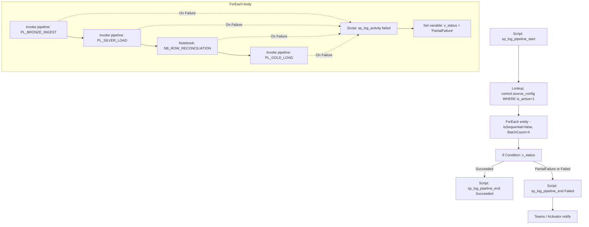

# PL_MASTER_ORCHESTRATOR — Build Instructions

**Purpose:** entry point. Reads `control.source_config`, iterates entities, and invokes Bronze → Silver → Reconciliation → Gold with per-entity error handling and full audit logging.

## Parameters
Same six standard parameters listed in `README.md`. `p_entity_name` is unused at this level.

## Variables (Set variable activity)
| Name         | Type    | Purpose                                    |
|--------------|---------|--------------------------------------------|
| v_status     | String  | Rolling status of the batch (`Succeeded`, `PartialFailure`, `Failed`) |
| v_error_msg  | String  | Concatenated error messages                |

## Activity graph



## Step-by-step

### 1. Create pipeline `PL_MASTER_ORCHESTRATOR`
Workspace → **+ New item** → **Data pipeline** → name `PL_MASTER_ORCHESTRATOR`.

### 2. Add pipeline parameters
Parameters tab → add the six standard parameters from `README.md`.

### 3. Add Script activity `SCR_Log_Start`
- **Connection:** `WH_Finance_Gold`
- **Script:**
  ```sql
  EXEC audit.sp_log_pipeline_start
      @run_id = @{pipeline().parameters.p_run_id},
      @parent_run_id = NULL,
      @pipeline_name = 'PL_MASTER_ORCHESTRATOR',
      @trigger_type  = '@{pipeline().TriggerType}',
      @triggered_by  = '@{pipeline().TriggerName}',
      @load_date     = '@{pipeline().parameters.p_load_date}';
  ```

### 4. Add Lookup activity `LKP_Get_Entities`
- **Connection:** `WH_Finance_Gold`
- **Query:** `SELECT entity_name, load_mode, tolerance_pct FROM control.source_config WHERE is_active = 1`
- **First row only:** unchecked.
- Link `SCR_Log_Start` → `LKP_Get_Entities` on **Success**.

### 5. Add ForEach `FE_Entities`
- **Items:** `@activity('LKP_Get_Entities').output.value`
- **Sequential:** false
- **Batch count:** 4 (tune to capacity)
- Link `LKP_Get_Entities` → `FE_Entities` on Success.

### 6. Inside ForEach — Invoke `PL_BRONZE_INGEST`
- Activity: **Invoke pipeline**.
- Invoked pipeline: `PL_BRONZE_INGEST`.
- Wait on completion: **true**.
- Parameters:
  | Name              | Value                                             |
  |-------------------|---------------------------------------------------|
  | `p_run_id`        | `@pipeline().RunId`                               |
  | `p_parent_run_id` | `@pipeline().parameters.p_run_id`                 |
  | `p_load_date`     | `@pipeline().parameters.p_load_date`              |
  | `p_entity_name`   | `@item().entity_name`                             |
  | `p_load_mode`     | `@item().load_mode`                               |
  | `p_tolerance_pct` | `@item().tolerance_pct`                           |

### 7. Chain Silver / Recon / Gold identically
Add three more Invoke-pipeline activities, each linked **On Success** of the previous:
- `PL_SILVER_LOAD` (same params)
- `NB_ROW_RECONCILIATION` (Notebook activity; pass `run_id`, `entity_name`, `tolerance_pct` as base parameters — see notebook file)
- `PL_GOLD_LOAD` (same params)

### 8. Error handler branch `SCR_Log_Failure`
Add a Script activity linked from **On Failure** of each of the four invocations above (multi-input allowed).
```sql
EXEC audit.sp_log_activity
    @run_id = '@{pipeline().parameters.p_run_id}',
    @activity_run_id = '@{activity('PL_BRONZE_INGEST').ActivityRunId}',   -- replace per branch
    @pipeline_name = 'PL_MASTER_ORCHESTRATOR',
    @activity_name = 'Invoke_<child>',                                    -- replace per branch
    @activity_type = 'InvokePipeline',
    @entity_name = '@{item().entity_name}',
    @layer = 'Orchestrator',
    @start_time_utc = '@{utcNow()}',
    @end_time_utc = '@{utcNow()}',
    @status = 'Failed',
    @error_message = '@{activity('PL_BRONZE_INGEST').Error.Message}';
```
Follow with **Set variable** → `v_status = 'PartialFailure'`.

### 9. After the ForEach — final log
Add **If Condition** on `@equals(variables('v_status'),'PartialFailure')`.
- **True branch:** Script `SCR_Log_End_Failed`
  ```sql
  EXEC audit.sp_log_pipeline_end
      @run_id = '@{pipeline().parameters.p_run_id}',
      @status = 'Failed',
      @error_message = '@{variables('v_error_msg')}';
  ```
  Followed by a Teams/Outlook activity (or leave to Activator).
- **False branch:** Script `SCR_Log_End_Success`
  ```sql
  EXEC audit.sp_log_pipeline_end
      @run_id = '@{pipeline().parameters.p_run_id}',
      @status = 'Succeeded';
  ```

### 10. Schedule
Home → Schedule → recurrence `Every day 02:00 UTC`. Save.

## Retry & timeout defaults
Apply to every Invoke-pipeline, Copy and Notebook activity:
- **Retry:** 3
- **Retry interval:** 30 s
- **Secure output:** off for POC (on for prod).
- **Activity timeout:** 02:00:00
