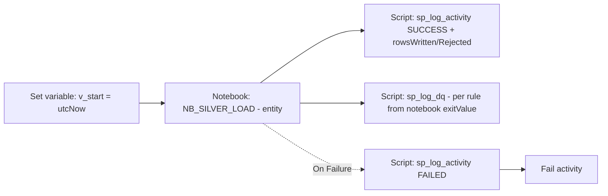

# PL_SILVER_LOAD — Build Instructions

> **SUPERSEDED — see `df_silver_load.md`.**
> The Silver stage now uses **Dataflow Gen2** (`DF_SILVER_<entity>`) instead of a notebook, so the customer sees the Dataflow-Gen2 pattern rather than another notebook example. Reconciliation remains a notebook (`NB_ROW_RECONCILIATION`).
>
> This file is kept for reference — the original notebook-based Silver design.

---

**Purpose:** validate Bronze data against schema/DQ rules, write conformant rows to Silver Delta, route rejects to `silver_rejects.<entity>` with a rule code, and audit everything.

The transformation itself lives in a notebook so the pipeline stays focused on orchestration.

## Activity graph



## Steps

### 1. Create pipeline `PL_SILVER_LOAD`
Same six parameters as master. Add variable `v_start` (String).

### 2. `SV_Set_Start` (Set variable)
Value: `@utcNow()`. Purpose: capture start time for audit.

### 3. `NB_Silver_Load` (Notebook activity)
- Notebook: `NB_SILVER_LOAD` (see `05-notebooks/NB_SILVER_LOAD.py`).
- Base parameters:
  | Name             | Value                                             |
  |------------------|---------------------------------------------------|
  | `run_id`         | `@pipeline().parameters.p_run_id`                 |
  | `entity_name`    | `@pipeline().parameters.p_entity_name`            |
  | `load_date`      | `@pipeline().parameters.p_load_date`              |
- Session config: small (2 vCores) is enough for the POC.
- Retry: 2, Retry interval: 60 s.

The notebook returns via `mssparkutils.notebook.exit(json.dumps({...}))` a payload:
```json
{
  "rowsRead": 5000,
  "rowsWritten": 4948,
  "rowsRejected": 52,
  "rules": [
    {"rule_code":"NULL_CUSTOMER_ID","rows_failed":47,"severity":"Reject","reject_table":"silver_rejects.gl_transactions"},
    {"rule_code":"INVALID_CURRENCY","rows_failed":5, "severity":"Reject","reject_table":"silver_rejects.gl_transactions"}
  ]
}
```

Access it in downstream activities as `@activity('NB_Silver_Load').output.result.exitValue` — parse with `json()`.

### 4. `SCR_Log_Activity_Success` (Script)
```sql
DECLARE @out NVARCHAR(MAX) = N'@{activity('NB_Silver_Load').output.result.exitValue}';
DECLARE @rowsRead    BIGINT = JSON_VALUE(@out, '$.rowsRead');
DECLARE @rowsWritten BIGINT = JSON_VALUE(@out, '$.rowsWritten');
DECLARE @rowsReject  BIGINT = JSON_VALUE(@out, '$.rowsRejected');

EXEC audit.sp_log_activity
    @run_id           = '@{pipeline().parameters.p_run_id}',
    @activity_run_id  = '@{activity('NB_Silver_Load').ActivityRunId}',
    @pipeline_name    = 'PL_SILVER_LOAD',
    @activity_name    = 'NB_Silver_Load',
    @activity_type    = 'Notebook',
    @entity_name      = '@{pipeline().parameters.p_entity_name}',
    @layer            = 'Silver',
    @start_time_utc   = '@{variables('v_start')}',
    @end_time_utc     = '@{utcNow()}',
    @status           = 'Succeeded',
    @rows_read        = @rowsRead,
    @rows_written     = @rowsWritten,
    @rows_rejected    = @rowsReject;
```

### 5. `SCR_Log_DQ` (Script) — write one row per rule
```sql
-- Iterate rules array
DECLARE @rules NVARCHAR(MAX) = JSON_QUERY(N'@{activity('NB_Silver_Load').output.result.exitValue}', '$.rules');

INSERT INTO audit.data_quality(run_id, entity_name, rule_code, rule_description, severity, rows_failed, reject_table)
SELECT
    '@{pipeline().parameters.p_run_id}',
    '@{pipeline().parameters.p_entity_name}',
    JSON_VALUE(r.value,'$.rule_code'),
    JSON_VALUE(r.value,'$.rule_code'),
    JSON_VALUE(r.value,'$.severity'),
    CAST(JSON_VALUE(r.value,'$.rows_failed') AS BIGINT),
    JSON_VALUE(r.value,'$.reject_table')
FROM OPENJSON(@rules) r;
```

### 6. `SCR_Log_Activity_Failure` (Script) — On Failure of notebook
```sql
EXEC audit.sp_log_activity
    @run_id           = '@{pipeline().parameters.p_run_id}',
    @activity_run_id  = '@{activity('NB_Silver_Load').ActivityRunId}',
    @pipeline_name    = 'PL_SILVER_LOAD',
    @activity_name    = 'NB_Silver_Load',
    @activity_type    = 'Notebook',
    @entity_name      = '@{pipeline().parameters.p_entity_name}',
    @layer            = 'Silver',
    @start_time_utc   = '@{variables('v_start')}',
    @end_time_utc     = '@{utcNow()}',
    @status           = 'Failed',
    @error_code       = '@{activity('NB_Silver_Load').Error.ErrorCode}',
    @error_message    = '@{activity('NB_Silver_Load').Error.Message}';
```
Then **Fail activity** to bubble up.
